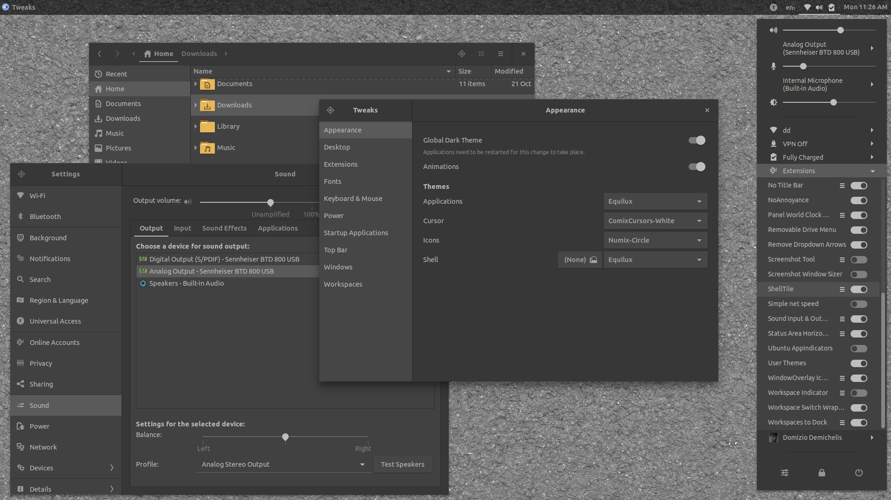

# Equilux Theme



The Equilux Theme provides a couple of full-dark, neutral-gray theme for GNOME/GTK+ based desktop environments. It supports GTK+ 3, GTK+ 2, GNOME Shell, Budgie, MATE, Unity, LightDM, GDM, Chrome theme, etc.

It is based on the [Materia Theme](https://github.com/nana-4/materia-theme). For detailed features and documentation, please, check upstream.

### Motivation

The Equilux themes provide a neutral dark-balanced color-scheme not designed to be __fancy__, but to be __useful__ for a few specific goals.

1. __Minimize eye strain__: when you pass many hours in front of the screen or you are hyper-sensitive to light, saturation and contrast, your eyes will benefit from a dull UI

2. __Avoid disrupting your circadian rhythms__: a neutral color-cast-free UI helps your body to produce enough melatonin at night time and sleep better, working nicely with software like `f.lux`, `redshift`, `NightLight`, ...

3. __Professional use in image editing, graphic design, 3D rendering__: in that fields any color cast or excessive contrast, brightness or darkness introduced by the UI would affect the overall perception of the color and balance of the images

4. __You may just like it__: even if the style is not the main goal, many people find that its very clean and minimalistic UI looks cool and professional


### Technical Focus

The Equilux Theme sticks to the upstream theme as much as possible, and is exclusively focused on the following points:

- Total removal of any color cast from the background elements (neutral base)
- Use of a neutral base for all the UI elements, with exception of a few button/boxes
- Maximum reduction of contrast/saturation
- Medium overall brightness/darkness of the UI

### Changes from the Upstream Theme

- The installer script installs only the Equilux variants
- Addition of Ubuntu font family and removal of the "M+ c1" font.
- A few minor cosmetic fixes
- Minimal changes in the color assignations in order to make the Equilux palette work OK with the theme.

## Theme Installation/Uninstallation

**Installation**: Download the latest `equilux-theme-*.tar.xz` version listed in the __Files__ tab [here](https://www.opendesktop.org/p/1182169/), unzip it and move the Equilux* dirs to `/usr/share/themes`. As an alternative you can download the source of the latest release [here](https://github.com/ddnexus/equilux-theme/releases) and run the `install.sh` script as privileged user.

**Uninstallation**: Delete the installed directories: `sudo rm -rf /usr/share/themes/Equilux{,-compact}`

## Font Customization

After you install the themes, you may want to customize the fonts by editing the `font-family` CSS rule inside the installed CSS file(s) `/usr/share/themes/Equilux{,-compact}/gnome-shell/gnome-shell.css`.

Here is the current line that affects the fonts:

```
font-family: Roboto, Ubuntu, Cantarell, Sans-Serif;
```

You can edit it manually with any text-editor, or you can run a simple command (courtesy of nana-4). Just remember to edit the "your-preferred-font" string :).

For example: prepending `your-preferred-font`:

```
sudo sed -i 's/Roboto/your-preferred-font, Roboto/g' /usr/share/themes/Equilux{,-compact}/gnome-shell/gnome-shell.css
```

or switching priority between `Roboto` and `Ubuntu`:

```
sudo sed -i 's/Roboto, Ubuntu/Ubuntu, Roboto/g' /usr/share/themes/Equilux{,-compact}/gnome-shell/gnome-shell.css
```

or change it as you prefer.

## GDM Theme Installation/Uninstallation

See the the upstream instruction [here](https://github.com/nana-4/materia-theme/wiki/GDM-Theme).

## Related Items

A quick list of items that - for different reasons - fit well with the Equilux style and concept. Please, submit your suggestions as a new Issue, so I will add a note in this section.

### Wallpapers

Seamless textures from various sources and authors, converted to low contrast/brightness grayscale available in the __Files__ tab [here](https://www.opendesktop.org/p/1182169/)

### Icons

- [Circle Numix Icons](https://github.com/numixproject/numix-icon-theme-circle): a circle themed icon set well maintained and not too bright (if you use Numix Folders below to tame the folder colors)

- [Numix Folders](https://github.com/numixproject/numix-folders): Customization script to change the colors and style of the numix folders (otherwise too bright and saturated). Recommended settings: Style: 6, Primary color: #9c9c9c, Secondary color; #9c9c9c, Symbol: #656565

- [Zafiro icons](https://github.com/zayronxio/Zafiro-icons): a flat theme with "washed" pastel colors

- [Papirus-Icon-Theme](https://github.com/PapirusDevelopmentTeam/papirus-icon-theme/): a flat, sticker-like icon theme with a few variants (recommended Papirus-Dark)

- [Papirus Folders Script](https://github.com/PapirusDevelopmentTeam/papirus-folders): Customization script to change the colors of the papirus folders. Recommended command: `papirus-folders -C grey --theme Papirus-Dark`

### GNOME Extensions

- [Darker Overview](https://extensions.gnome.org/extension/1177/darker-overview/): Customize the darkness of the background in the Overview. It can also remove the ugly vignette effect

- [Desaturate All](https://extensions.gnome.org/extension/1102/desaturate-all/): Desature the entire gnome workspace (I hacked a copy to have 4 deaturation levels instead of all-or-none: ask if interested)

- [AppMenu Regular Icons](https://extensions.gnome.org/extension/970/appmenu-regular-icons/): Disables Symbolic Icons in the app menu. In the mostly grayscale UI, a small colored icon is useful to quickly identify the app you are in. Besides it normalizes the icons that otherwise would be grey or colored with no particular consistence.

- [Background Logo](https://extensions.gnome.org/extension/889/background-logo/): Overlay an icon/pict in the bottom right corner. A bit buggy and useless :) but a nice touch.

### App Themes and Settings

- [Equilux-Telegram](https://github.com/aquatix/Equilux-Telegram-Theme)

- [Equilux-Flubox](https://www.opendesktop.org/p/1193958/)

- [HexChat](https://dl.hexchat.net/themes/Zenburn.hct): the Zenburn theme fits well with Equilux

- [Smyck terminal](https://github.com/DarthWound/smyck-gnome-terminal): a script to use SMYCK palette in GNOME Terminal

- [Equilux-Firefox](https://github.com/cj-sv/equilux-firefox): an Equilux color scheme for Firefox userContent.css and userChrome.css.

- [Tint2](https://gist.github.com/meskarune/329826937aea0effdbfa9f3bdc7e7989): tint2 panel theme that matches Equilux.

- TBD: add the style settings consistent with the Equilux Palette for apps like Vivaldi, Tilix, RubyMine, SmartGit, DeepGit, ...

### Browser Extensions

- [Dark Reader](https://github.com/darkreader/darkreader): Chrome and FireFox extension that inverts brightness of web pages and aims to reduce eyestrain while browsing the web.

## Branches

Master is always the upstream master: no changes from the base theme there.
The `equilux-*` branch(es) are the branches with the changes from the upstream master.
Please, notice that the `*-dev` branches are getting rebased on top of master at each new release. The old versions will be tagged and will not be removed/rebased.

## License

The Equilux Theme is distributed under the terms of the GNU General Public License, version 2 or later. See the [`COPYING`](COPYING) file for details.

## Credits

- All credits go to the [Materia Theme](https://github.com/nana-4/materia-theme), its author and contributors.
